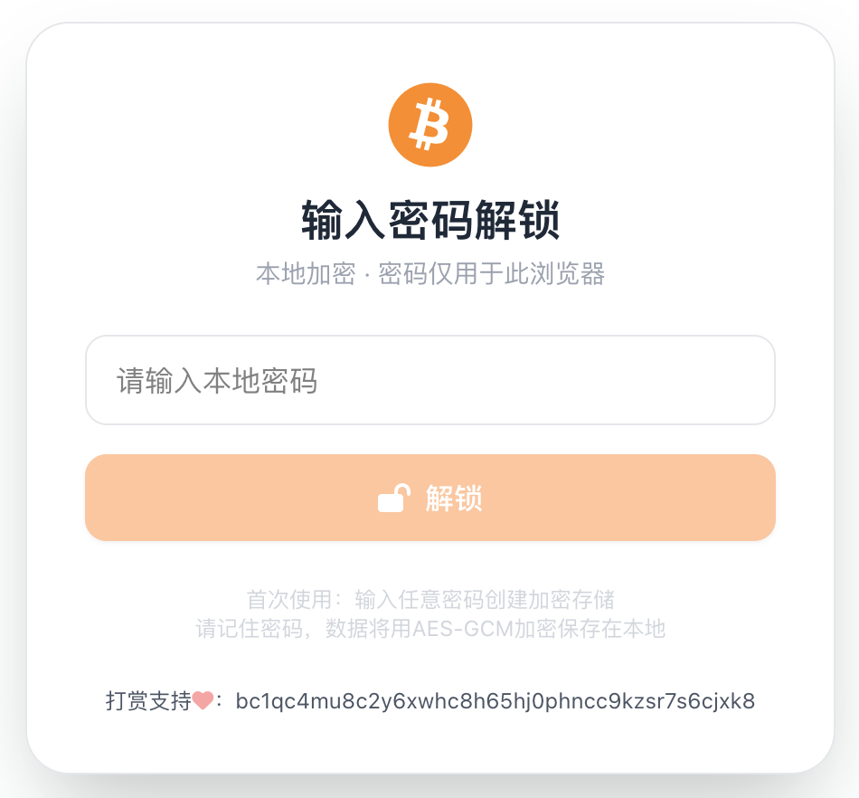
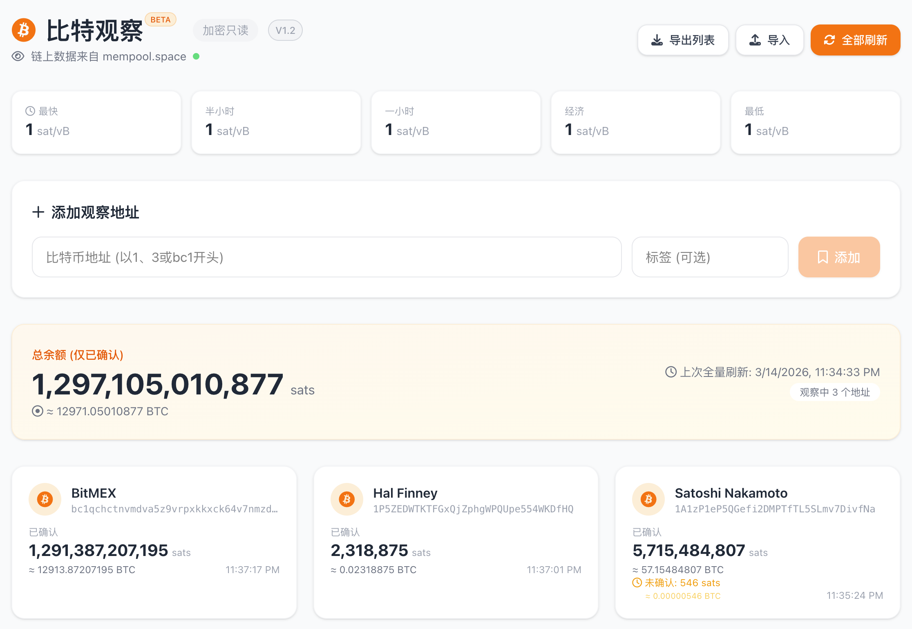

# BitWatch / 比特观察

<div align="center">
  
  
  
</div>

<br>

<div align="center">
  <strong>A neat and clean bitcoin watch wallet. Single Page App with just a standalone html file.</strong>
  <br>
  <strong>一个清爽的比特币观察钱包。单网页文件，打开即用。</strong>
</div>

<br>

## ✨ Features / 特性

| English | 中文 |
|---------|------|
| **Lightweight** - Single HTML file, download and open in browser | **轻量** - 单网页文件，下载到本机，用浏览器打开即可使用 |
| **Fast** - Uses mempool.space API, no blockchain download needed | **快速** - 使用 mempool API，无需等待下载区块链 |
| **Secure** - Watch-only addresses, no private keys, encrypted localStorage | **安全** - 只导入地址观察，不碰触私钥，数据加密存储在浏览器 localStorage |
| **Open** - Watch any bitcoin address, no restrictions | **开放** - 可以观察任何比特币地址，没有任何限制 |
| **Sats-Oriented** - Display in sats, no fiat conversion, cultivate coin-based thinking | **聪本位** - 突出显示 sats，不刷新法币对价，培养币本位思维 |

## 🖼️ Screenshot / 截图

<div align="center">
  
  <br>
  <em>Unlock Screen / 解锁界面</em>
</div>

<br>

<div align="center">
  
  <br>
  <em>Main Interface / 主界面</em>
</div>

## 🚀 Quick Start / 快速开始

### English
1. Download `bitwatch_V1.2.html` (or the latest version)
2. Open the file with any modern browser (Chrome, Firefox, Edge, Safari)
3. Enter a password to initialize (this is your local encryption password)
4. Start adding bitcoin addresses to watch

### 中文
1. 下载 `bitwatch_V1.2.html`（或最新版本）
2. 用任意现代浏览器打开（Chrome、Firefox、Edge、Safari 均可）
3. 输入密码初始化（这是你的本地加密密码）
4. 开始添加要观察的比特币地址

Integrity Check / 完整性校验：
```
% sha256sum bitwatch_V1.2.html
e702863a9721a0cd562e33bca8a4e9415cd3e9f3405b1939132626eed7fc4f92  bitwatch_V1.2.html
```

## 🔒 Security / 安全性

### English
- **No Private Keys** - This is a watch-only wallet, never asks for private keys
- **Local Encryption** - All address data is encrypted with AES-GCM before storing in localStorage
- **No Backend** - Pure frontend, directly communicates with mempool.space API
- **Self-Contained** - Single HTML file, easy to verify and audit

### 中文
- **无私钥** - 纯观察钱包，从不触碰私钥
- **本地加密** - 所有地址数据在存入 localStorage 前均使用 AES-GCM 加密
- **无后端** - 纯前端实现，直接与 mempool.space API 通信
- **单文件** - 单一 HTML 文件，易于审查和验证

## 📦 Storage / 存储

### English
Data is encrypted and stored in your browser's `localStorage`. Clearing browser data will remove all saved addresses. The encryption key is derived from your password using PBKDF2.

### 中文
数据经加密后存储在浏览器的 `localStorage` 中。清除浏览器数据将删除所有保存的地址。加密密钥通过 PBKDF2 从您的密码派生。

## 🔄 Reset / 重置

### English
If you forget your password, click "Forgot password? Reset encrypted storage" on the unlock screen. This will clear all stored data and allow you to set a new password.

### 中文
如果忘记密码，在解锁界面点击"忘记密码？重置加密存储"。这将清除所有已存储数据，允许您设置新密码。

## 📊 Features Details / 功能详解

### English
- **Real-time Fees** - Display recommended network fees from mempool.space
- **Balance Tracking** - Show confirmed and unconfirmed balances
- **Transaction History** - View recent transactions for each address
- **Import/Export** - Backup and restore your watchlist
- **Bulk Refresh** - Update all addresses with one click

### 中文
- **实时费率** - 显示 mempool.space 推荐的网络费率
- **余额追踪** - 展示已确认和未确认余额
- **交易历史** - 查看每个地址的最近交易记录
- **导入/导出** - 备份和恢复观察列表
- **批量刷新** - 一键更新所有地址

## 🛠️ Tech Stack / 技术栈

- Vue.js 3 (CDN)
- TailwindCSS (CDN)
- Font Awesome 6
- Web Crypto API (AES-GCM encryption)
- mempool.space API

## 📜 Version History / 版本历史

### V1.2 (March 2026)
- **优化显示** - 地址卡片添加 BTC 数量显示，界面细节优化
- **添加重置功能** - 忘记密码时可重置加密存储
- **BETA标识** - 添加版本标签，明确测试版状态

### V1.1 (March 2026)
- **本地加密** - 引入 AES-GCM 加密，所有数据安全存储在 localStorage
- **密码保护** - 添加解锁界面，保护观察列表隐私

### V1.0 (March 2026)
- **初始版本** - 基础功能实现
- **地址添加/删除** - 支持添加和移除观察地址
- **余额查询** - 实时获取地址余额
- **交易历史** - 查看地址交易记录
- **导入/导出** - 备份和恢复观察列表
- **费率显示** - 实时显示 mempool.space 推荐费率

## 📝 License / 许可证

MIT © 2026 Evan Liu

## 👤 Author / 作者

**Evan Liu**  
© 2026 All Rights Reserved  
Email: evan at blockcoach dot com

*Built with ❤️ for the bitcoin community*  
*为比特币社区用心打造*

## ☕ Support / 支持

**打赏/捐赠BTC到**: `bc1qk2c4se8stxh4u2l5r8yc9ah3z27uzvzclrke5e`

## ⚠️ Disclaimer / 免责声明

### English
This tool is for educational and informational purposes only. Always verify transactions on multiple sources. Use at your own risk.

### 中文
此工具仅用于教育和信息目的。请始终在多个来源验证交易。使用风险自负。

---

<div align="center">
  <sub>Version 1.2 | Released March 2026</sub>
</div>
