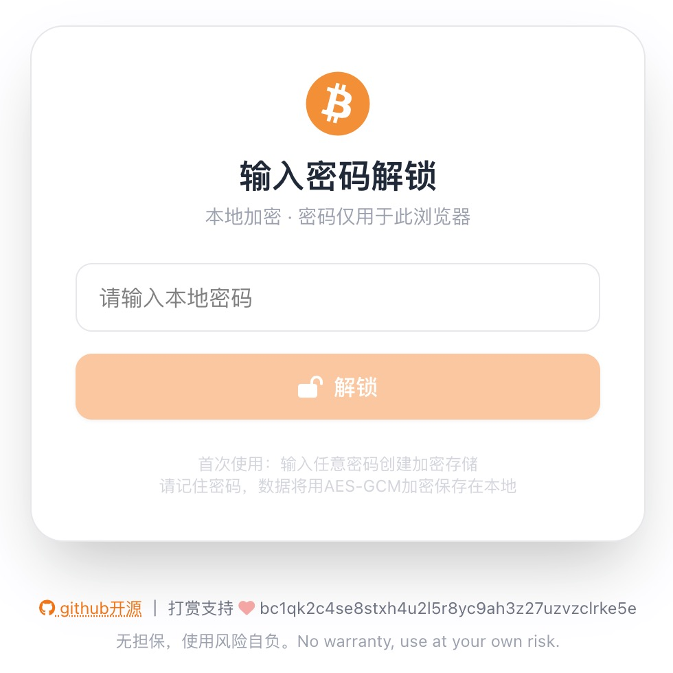
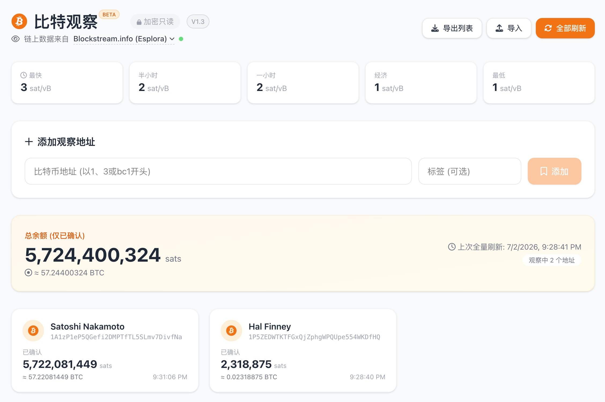

# BitWatch

  
  
  

 

  <strong>A neat and clean bitcoin watch wallet. Single Page App — just a standalone HTML file.</strong>

 

  
   
  <em>Unlock Screen</em>

 

  
   
  <em>Main Interface</em>

## ✨ Features

- **Lightweight** — Single HTML file, download and open in browser
- **Fast** — Uses Blockstream Esplora / mempool.space API, no blockchain download needed
- **Secure** — Watch-only addresses, no private keys, encrypted localStorage
- **Open** — Watch any bitcoin address, no restrictions
- **Sats-Oriented** — Display in sats, no fiat conversion, cultivate coin-based thinking
- **Multi-API** — Switch between Blockstream Esplora and mempool.space
- **Dark Mode** — Auto-follows system light/dark appearance
- **Privacy Lock** — One-click lock button to protect your watchlist when away

## 🚀 Quick Start

1. Download [`bitwatch.html`](https://github.com/hmisty/bitwatch/raw/main/bitwatch.html) (or clone the repo)
2. Open `bitwatch.html` with any modern browser (Chrome, Firefox, Edge, Safari)
3. Enter a password to initialize (this is your local encryption password)
4. Start adding bitcoin addresses to watch

## 🔒 Security

- **No Private Keys** — This is a watch-only wallet, never asks for private keys
- **Local Encryption** — All address data is encrypted with AES-GCM before storing in localStorage
- **No Backend** — Pure frontend, directly communicates with the blockchain API
- **Self-Contained** — Single HTML file, easy to verify and audit

## 📦 Storage

Data is encrypted and stored in your browser's `localStorage`. Clearing browser data will remove all saved addresses. The encryption key is derived from your password using PBKDF2.

## 🔄 Reset

If you forget your password, click "Forgot password? Reset encrypted storage" on the unlock screen. This will clear all stored data and allow you to set a new password.

## 📊 Feature Details

- **Real-time Fees** — Display recommended network fees from the selected API
- **Balance Tracking** — Show confirmed and unconfirmed balances
- **Transaction History** — View recent transactions for each address (24-hour timestamps)
- **Import/Export** — Backup and restore your watchlist
- **Bulk Refresh** — Update all addresses with one click
- **Manual Lock** — Return to the password screen instantly to protect privacy when leaving your computer

## 🛠️ Tech Stack

- Vue.js 3 (CDN)
- TailwindCSS 4 (CDN)
- Font Awesome 6
- Web Crypto API (AES-GCM encryption)
- Blockstream Esplora API / mempool.space API (switchable)

## 📜 Version History

### V1.3 (July 2026)
- Multi-API support: Blockstream Esplora added, switchable with mempool.space
- API selector in the subtitle bar, auto-refresh fees & balances on switch
- System light/dark mode support (follows OS preference)
- Manual lock button to instantly return to the password screen
- 24-hour time format for all timestamps
- Embedded favicon as base64 data URI (fully single-file SPA)
- GitHub Actions deployment with automatic CNAME
- UI polish: GitHub link & disclaimer on unlock screen

### V1.2 (March 2026)
- Display BTC amount on address cards
- Reset feature for forgotten passwords
- BETA label

### V1.1 (March 2026)
- AES-GCM encryption for all stored data
- Password-protected unlock screen

### V1.0 (March 2026)
- Initial release
- Add/remove watch addresses
- Real-time balance & transaction history
- Import/export watchlist
- Fee estimates display

## 📝 License

MIT © 2026 Evan Liu

## 👤 Author

**Evan Liu**  
© 2026 All Rights Reserved  
Email: evan at blockcoach dot com

*Built with ❤️ for the bitcoin community*

## ☕ Support

**Donate BTC**: `bc1qk2c4se8stxh4u2l5r8yc9ah3z27uzvzclrke5e`

## ⚠️ Disclaimer

This tool is for educational and informational purposes only. Always verify transactions on multiple sources. Use at your own risk.

---

  Version 1.3 | Released July 2026

